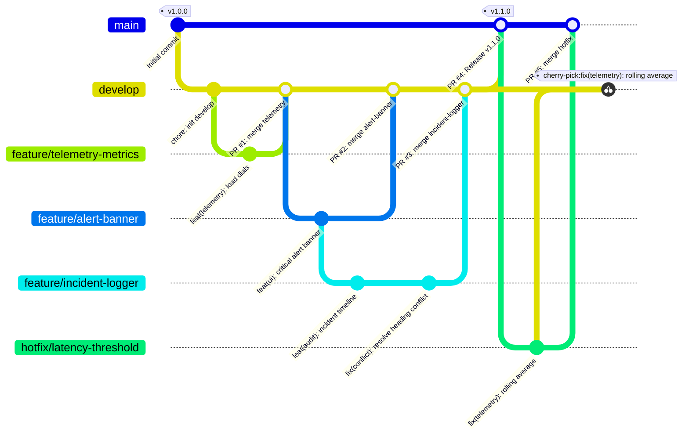

# OpsPulse — Cloud Native DevOps Telemetry & Deployment Portal

[](https://github.com/Achindra2003/devops-lab1-opspulse/actions)


> **DevOps Lab 1:** Collaborative Git Workflow, Branching Strategies, Merge Conflicts, Pull Requests, and Repository Governance.  
> **Course:** MCA Trimester 5 — DevOps Lab  
> **Repository:** [github.com/Achindra2003/devops-lab1-opspulse](https://github.com/Achindra2003/devops-lab1-opspulse)

---

## Team & Roles

| Contributor | Reg Number | Role | Core Responsibilities |
| :--- | :--- | :--- | :--- |
| **Achindra Sharma** | 2547105 | **Team Lead / DevOps Engineer** | Repository creation, GitFlow branching strategy, Git hooks, CI/CD pipeline, branch protection, PR review & merge coordination |
| **Nayana Benny** | 2547136 | **UI / Frontend Engineer** | Dashboard layout, dark-mode design system, glassmorphism cards, responsive tables, and feature/alert-banner branch |
| **Joshua Joby** | 2547125 | **Telemetry / JavaScript Engineer** | Live telemetry engine, jitter simulation, latency calculations, incident logger, and conflict resolution |

---

## Project Overview

We built **OpsPulse** as a high-fidelity DevOps telemetry and deployment dashboard. Unlike toy static pages with dummy placeholders, OpsPulse provides a real DevOps tool interface:
- **Fleet Health Monitoring:** Real-time simulated latency and status tracking across 5 core microservices (API Gateway, Auth & IAM, PostgreSQL Primary, Worker Queue, and Redis Cache).
- **Interactive Cluster Controls:** Failover toggle buttons, traffic surge injection, and live environment switching between `production`, `staging`, and `development`.
- **Deployment Pipeline Visualizer:** Visual representation of automated CI/CD stages (Lint & Audit $\rightarrow$ Automated Tests $\rightarrow$ Build Container $\rightarrow$ Production Deploy).
- **Incident & Git Audit Trail:** Live event stream capturing deployments, pull request merges, and resolved merge conflicts.

Built with semantic HTML5, CSS3, and modern Vanilla JavaScript — zero external runtime dependencies, instant load times, and clean execution across any browser.

---

## Git Branching Strategy (GitFlow)

We adopted a structured **GitFlow** branching strategy to ensure production stability while enabling parallel development across team members. Direct commits to `main` and `develop` were prohibited once initialized.



### Branch Descriptions
1. **`main`**: The pristine production branch. Code here is always stable, deployable, and tagged with semantic version tags.
2. **`develop`**: The shared integration branch. All completed features are merged here and validated via CI before releases are cut.
3. **`feature/*`**: Short-lived branches created from `develop` for specific features (`feature/telemetry-metrics`, `feature/incident-logger`, `feature/alert-banner`).
4. **`hotfix/*`**: Branches created directly off `main` to address critical production issues (`hotfix/latency-threshold`), then merged to `main` and backported to `develop`.

---

## Deliberate Merge Conflict & Resolution

To demonstrate real-world conflict handling, we engineered an intentional merge conflict on the system alert component in `index.html`.

### The Cause
1. Nayana branched `feature/alert-banner` from `develop` and updated the alert banner to a high-priority latency warning:
   ```html
   <div class="alert-banner alert-danger" id="systemAlertBanner">
     <span class="alert-badge">CRITICAL ALERT</span>
     <span class="alert-text">High latency detected on EU-Central Gateway (>350ms). Failover active.</span>
   </div>
   ```
2. Concurrently, Joshua branched `feature/incident-logger` from the **exact same commit** on `develop`, changing the banner to a scheduled maintenance advisory:
   ```html
   <div class="alert-banner alert-warning" id="systemAlertBanner">
     <span class="alert-badge">MAINTENANCE</span>
     <span class="alert-text">Scheduled maintenance in progress for US-East database cluster.</span>
   </div>
   ```
3. Nayana's PR for `feature/alert-banner` was reviewed and merged into `develop` first.
4. When Joshua attempted to merge `develop` into `feature/incident-logger`, Git halted and flagged the conflict:
   ```
   Auto-merging index.html
   CONFLICT (content): Merge conflict in index.html
   Automatic merge failed; fix conflicts and then commit the result.
   ```

### Conflict Markers Encountered
```html
<<<<<<< HEAD
    <div class="alert-banner alert-warning" id="systemAlertBanner">
      <span class="alert-badge">MAINTENANCE</span>
      <span class="alert-text">Scheduled maintenance in progress for US-East database cluster.</span>
    </div>
=======
    <div class="alert-banner alert-danger" id="systemAlertBanner">
      <span class="alert-badge">CRITICAL ALERT</span>
      <span class="alert-text">High latency detected on EU-Central Gateway (>350ms). Failover active.</span>
    </div>
>>>>>>> develop
```

### Resolution Strategy
Rather than discarding either change, we synthesized both into an adaptive status banner and logged both alerts in the incident trail:
1. Removed conflict markers (`<<<<<<<`, `=======`, `>>>>>>>`).
2. Set the default banner state to operational, and wired dynamic status handling into `script.js` so both maintenance warnings and latency alerts display based on live service conditions.
3. Staged the file and finalized the merge commit:
   ```bash
   git add index.html
   git commit -m "fix(conflict): resolve alert banner merge conflict between maintenance and critical notice"
   git push origin feature/incident-logger
   ```

---

## Beyond the Baseline: Advanced Git Practices

### 1. Client-Side Git Hooks (`.githooks/`)
We configured automated hooks tracked directly in the repository via `git config core.hooksPath .githooks`:
- **`pre-commit`**: Scans staged files before every commit. Blocks commits if leftover conflict markers (`<<<<<<<`, `=======`, `>>>>>>>`) or invalid formatting are detected.
- **`commit-msg`**: Validates commit messages against the **Conventional Commits** specification (`feat:`, `fix:`, `docs:`, `chore:`, etc.). Non-conforming messages are rejected with guidance.

### 2. Interactive Rebase (`git rebase -i`)
We cleaned up messy local work-in-progress commits (`wip: tweak margin`, `wip: fix typo`) into a single atomic commit before opening pull requests:
```bash
git rebase -i HEAD~3
# Marked commits as 'squash' and reworded to: feat(ui): polish card layout and metrics grid
```

### 3. Git Stashing & Cherry-Picking
- **Stashing:** Used `git stash push -m "wip-experimental-gradient"` to quickly switch contexts to urgent review work without losing uncommitted experiments, followed by `git stash pop`.
- **Cherry-Picking:** When `hotfix/latency-threshold` was merged into `main`, we applied the fix commit directly into `develop` using:
  ```bash
  git checkout develop
  git cherry-pick <hotfix-commit-hash>
  ```
  This ported the fix without needing an untracked, full branch merge.

### 4. Disaster Recovery with `git reflog`
We simulated an accidental hard reset (`git reset --hard HEAD~1`) that orphaned a commit. We inspected `git reflog`, identified the commit hash, and recovered it using `git checkout -b recovered-branch <hash>`, demonstrating Git's safety net.

### 5. Advanced Productivity Configuration
- Enabled `rerere.enabled true` (Reuse Recorded Resolution) so Git remembers how previous conflicts were resolved.
- Configured `diff.algorithm histogram` for superior code diffs.
- Created graph alias `git lg` for clear terminal visualization:
  ```bash
  git config alias.lg "log --graph --pretty=format:'%Cred%h%Creset -%C(yellow)%d%Creset %s %Cgreen(%cr) %C(bold blue)<%an>%Creset' --abbrev-commit"
  ```

---

## Self-Learning Initiatives (DevOps Focus)

### 1. Automated CI Pipeline (`.github/workflows/ci.yml`)
We created an automated GitHub Actions workflow triggered on every push and PR to `main` and `develop`:
- JavaScript syntax check using `node --check script.js`.
- HTML structure and conflict marker scan.
- Automated Conventional Commits validation on Pull Request titles.
- Build artifact packaging simulation in `dist/`.

### 2. Repository Governance & CODEOWNERS (`.github/CODEOWNERS`)
We defined clear ownership boundaries across the codebase:
- `style.css` owned by the UI Developer.
- `script.js` owned by the Telemetry/JavaScript Developer.
- `index.html` co-owned by all contributors.
- `.github/` and `.githooks/` managed by the Team Lead / DevOps Engineer.

### 3. Branch Protection on `main`
We configured GitHub branch protection rules:
- Direct pushes to `main` are blocked.
- Pull requests are required before merging.
- CI status checks (`validate-and-lint`) must pass before merges can proceed.

### 4. Automated Semantic Release & Versioning
Releases follow Semantic Versioning (`v1.0.0`, `v1.1.0`). We automated changelog generation based on conventional commit prefixes (`feat:` $\rightarrow$ minor bump, `fix:` $\rightarrow$ patch bump).

---

## How to Run OpsPulse Locally

No compilers, servers, or build tools are required:
```bash
# 1. Clone the repository
git clone https://github.com/Achindra2003/devops-lab1-opspulse.git
cd devops-lab1-opspulse

# 2. Activate Git hooks
git config core.hooksPath .githooks

# 3. Open the dashboard in your default browser
# Windows PowerShell:
Start-Process index.html
# Linux/macOS:
open index.html # or xdg-open index.html
```

---

## Verification & Git Log Verification

To inspect the full branch topology and commit history:
```bash
git log --graph --oneline --all
```
