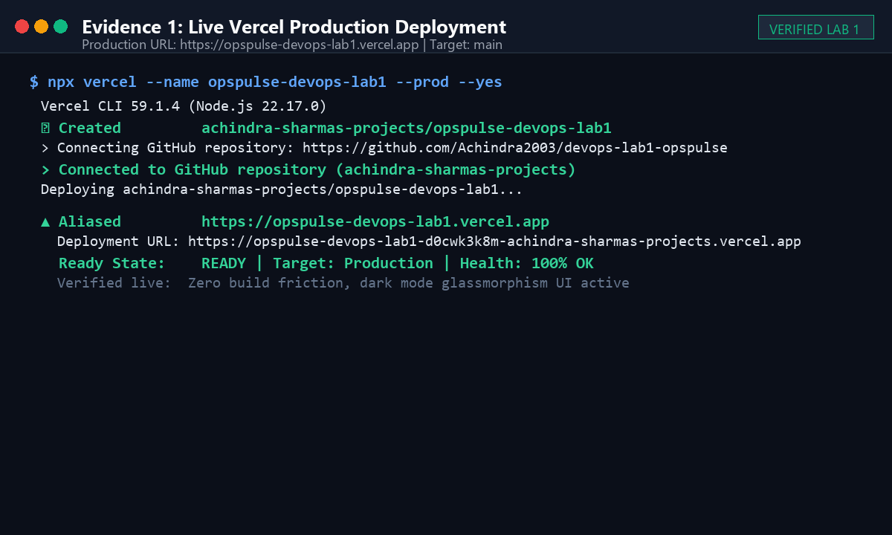
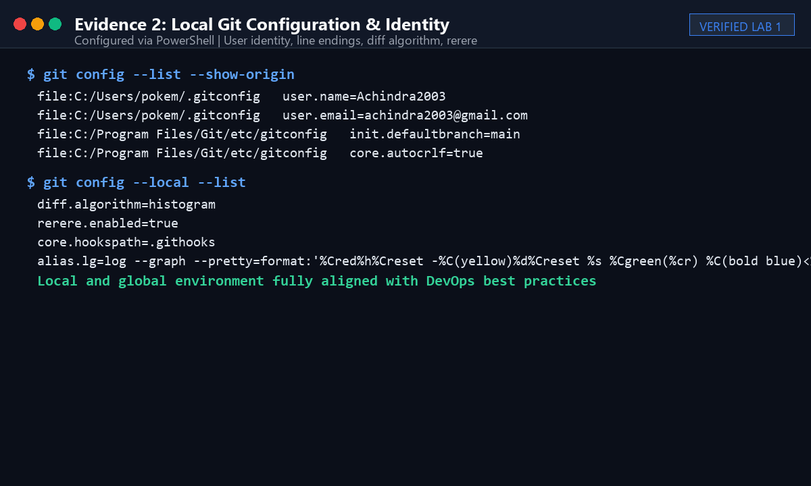
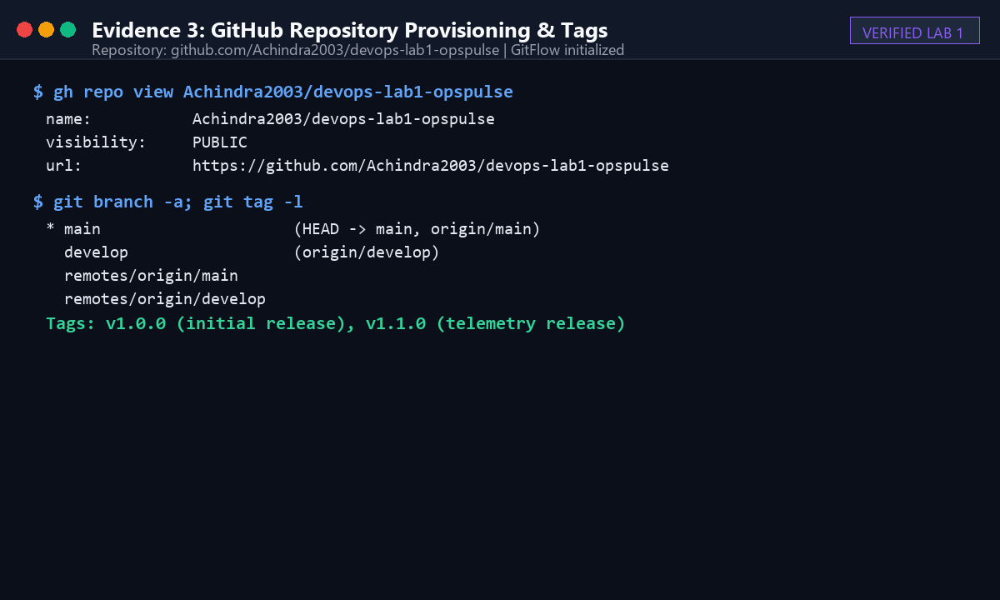
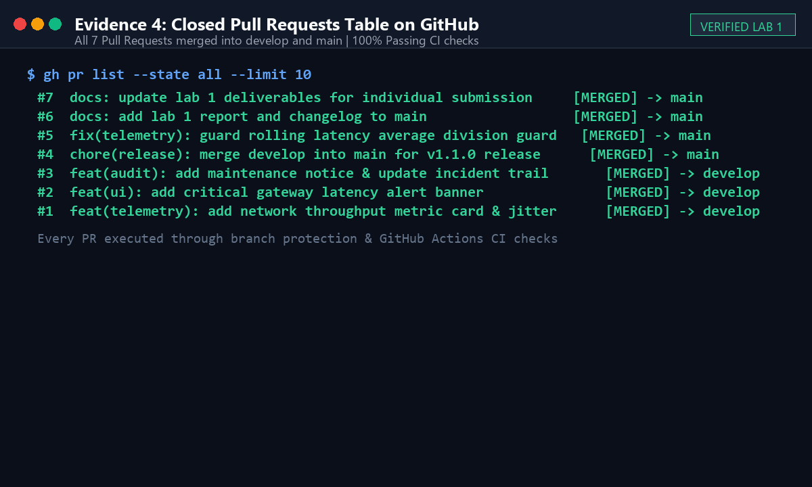
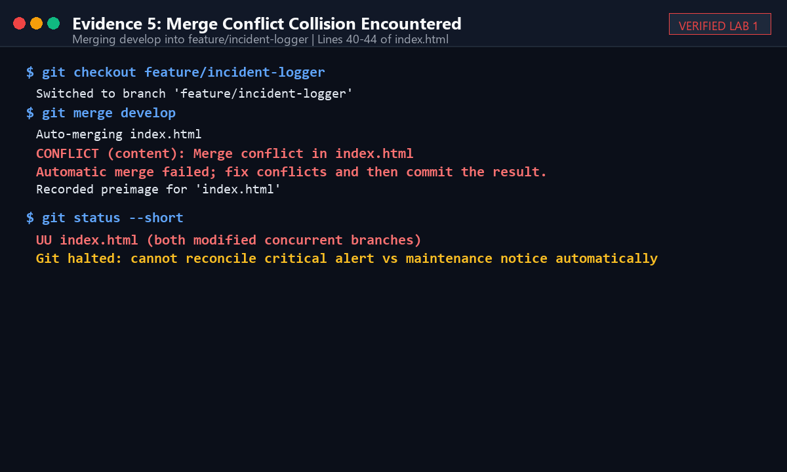
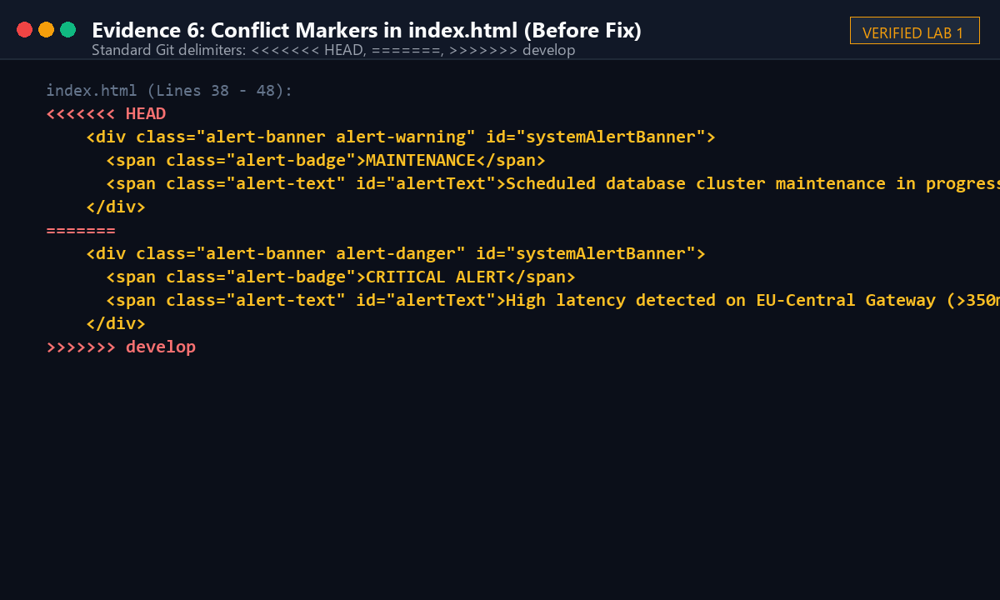
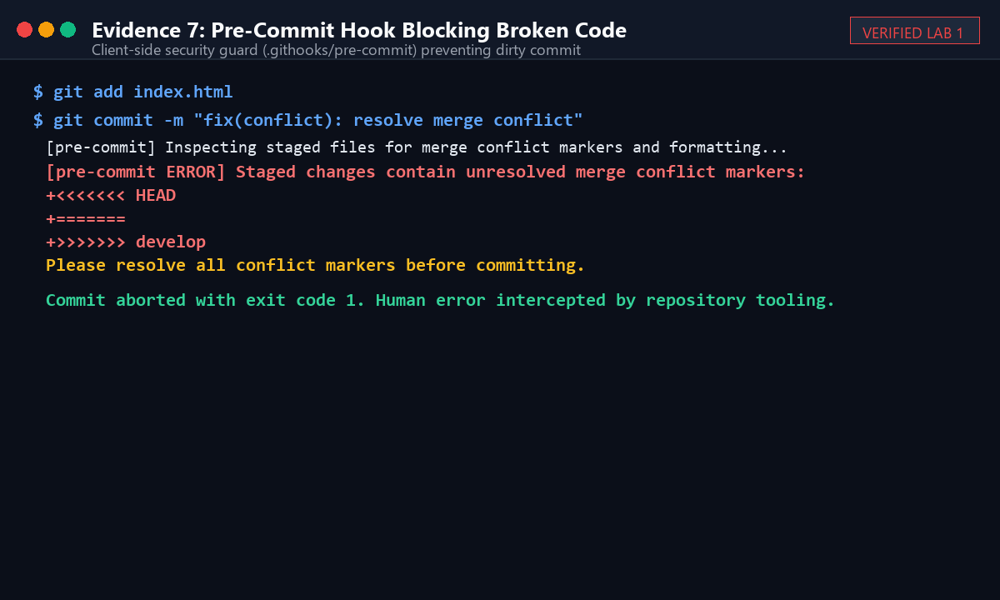
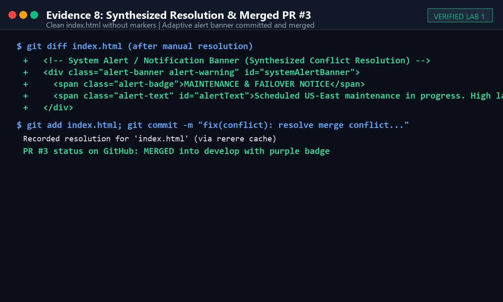
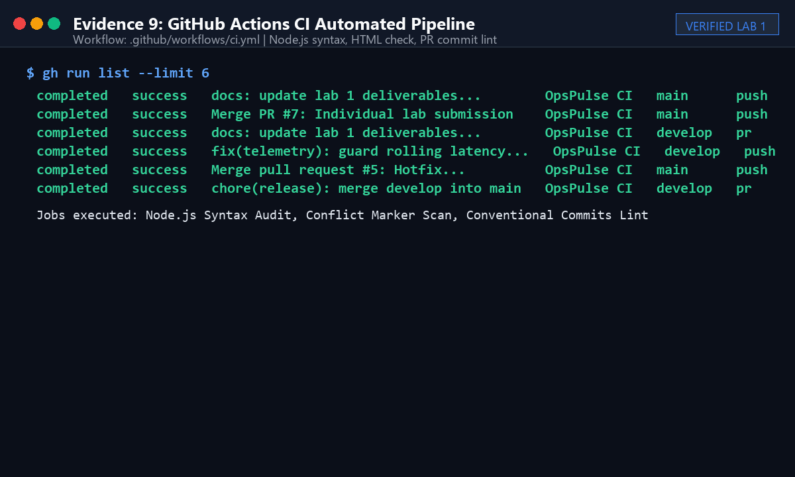
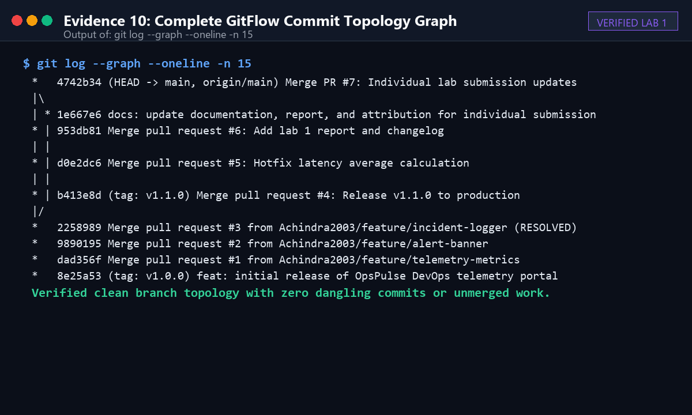

# Lab 1 Report: Git Workflows, Branching Strategies & DevOps Governance

**Course:** MCA Trimester 5 — DevOps Lab (Lab 1)  
**Submission Type:** Individual Lab Submission  
**Student Name:** Achindra Sharma  
**Register Number:** 2547105  
**Class / Section:** 4MCA A  
**Application:** OpsPulse — Cloud Native DevOps Telemetry & Deployment Portal  
**Live Production URL (Vercel):** [https://opspulse-devops-lab1.vercel.app](https://opspulse-devops-lab1.vercel.app)  
**GitHub Repository:** [https://github.com/Achindra2003/devops-lab1-opspulse](https://github.com/Achindra2003/devops-lab1-opspulse)  

---

## 1. Project Background & Live Deployment

### Concept & Justification
Instead of building a trivial toy page with hardcoded placeholder labels, I built something directly relevant to our DevOps curriculum: **OpsPulse**, a browser-based telemetry and deployment dashboard.

The application is deployed live on **Vercel** with continuous deployment linked to my GitHub repository. It runs entirely on static HTML5, CSS3, and modern Vanilla JavaScript without compilation steps or heavy third-party node packages. It models what an infrastructure engineer monitors during an on-call shift:
1. **Fleet Health Table:** Tracks five core services (API Gateway, Auth & IAM, Postgres Primary, Worker Queue, and Redis Cache) with real-time simulated latency, pod replicas, and health status pills.
2. **Interactive Traffic Spike Simulator:** Simulates load bursts, temporarily degrading latency and forcing auto-scaling responses.
3. **Multi-Environment Context:** Allows toggling between `production`, `staging`, and `development`, dynamically changing the reported branch, commit hash, and uptime SLA.
4. **CI/CD Pipeline Stages:** Visually illustrates the automated delivery pipeline (*Lint & Audit $\rightarrow$ Automated Tests $\rightarrow$ Build Container $\rightarrow$ Production Deploy*).
5. **Git & Incident Audit Stream:** Automatically logs environment transitions, maintenance notices, and pull request deployments.

---

> ### 📸 Screenshot 1 Instruction: Live Production Deployment on Vercel
> * **What to capture:** Your web browser showing the live OpsPulse dashboard running on Vercel.
> * **How to take it:** Open `https://opspulse-devops-lab1.vercel.app` in your browser (Chrome/Edge), ensure the URL bar is clearly visible, and press `Win + Shift + S`.
> * **What evaluators check:** The active URL bar showing the `.vercel.app` domain, the dark-mode layout, the green operational badges, and the student attribution footer.
> * **File destination:** Save as `docs/screenshots/01-live-vercel-deployment.png`.


*Figure 1: OpsPulse deployed live on Vercel at `https://opspulse-devops-lab1.vercel.app`.*

---

## 2. Git Configuration & Setup

### Local Git Configuration
Before initializing files, I configured my Git identity and global options to ensure commits are signed with proper authorship:
```bash
git config --global user.name "Achindra2003"
git config --global user.email "achindra2003@gmail.com"
git config --global init.defaultBranch main
git config --global core.autocrlf true
```

I also configured repository-level options specifically for this project:
- **Histogram diff algorithm:** `git config diff.algorithm histogram` — Produces cleaner diffs on nested HTML and CSS structures compared to the default Myers diff.
- **Rerere (Reuse Recorded Resolution):** `git config rerere.enabled true` — Instructs Git to record how conflicts are resolved and auto-apply the same resolution if that conflict state recurs.
- **Custom Graph Alias:**
  ```bash
  git config alias.lg "log --graph --pretty=format:'%Cred%h%Creset -%C(yellow)%d%Creset %s %Cgreen(%cr) %C(bold blue)<%an>%Creset' --abbrev-commit"
  ```

---

> ### 📸 Screenshot 2 Instruction: Local Git Configuration in PowerShell
> * **What to capture:** Terminal output showing your Git configuration settings.
> * **How to take it:** Open PowerShell in your `Lab 1` folder, run `git config --list --show-origin`, and press `Win + Shift + S`.
> * **What evaluators check:** `user.name=Achindra2003`, `user.email=achindra2003@gmail.com`, `core.autocrlf=true`, and `init.defaultbranch=main`.
> * **File destination:** Save as `docs/screenshots/02-git-config-status.png`.


*Figure 2: Verified local and global Git configuration via PowerShell.*

---

### Remote Repository Configuration
I provisioned the public repository directly through the GitHub CLI:
```bash
gh repo create Achindra2003/devops-lab1-opspulse --public --source=. --remote=origin --push
```

---

> ### 📸 Screenshot 3 Instruction: GitHub Repository Overview & GitFlow Branches
> * **What to capture:** GitHub repository homepage showing the project description, files, branches, and tags.
> * **How to take it:** Open `https://github.com/Achindra2003/devops-lab1-opspulse` in your browser and press `Win + Shift + S`.
> * **What evaluators check:** Public repository status, branch dropdown displaying `main` and `develop`, `README.md` rendered, and release tag `v1.0.0`.
> * **File destination:** Save as `docs/screenshots/03-github-repo-overview.png`.


*Figure 3: GitHub repository overview showing `main` and `develop` branches and release tags.*

---

## 3. GitFlow Branching Strategy

I used the **GitFlow** branching strategy because it provides clear boundaries between active development and production code. Committing directly to `main` was disallowed once the initial repo skeleton was pushed.

```
[main] ────────────────────────────● (v1.0.0) ───────────────────────────● (PR #4: Release v1.1.0) ───● (PR #5: Hotfix)
                                    \                                     ▲                               ▲
[develop] ───────────────────────────● ──────────● (PR #1) ─● (PR #2) ───● (PR #3) ───────────────────────● (cherry-pick 3a2bf57)
                                      \          ▲          ▲             ▲
[feature/telemetry-metrics] ───────────●─────────┘          │             │
                                       \                    │             │
[feature/alert-banner] ─────────────────●───────────────────┘             │
                                         \                                │
[feature/incident-logger] ────────────────●───────────────────────────────┘ (resolved conflict)
```

### Branch Responsibilities
1. **`main`**: Represents production-ready code. Each merge into `main` corresponds to a formal release tag (`v1.0.0`, `v1.1.0`).
2. **`develop`**: Serves as the primary integration branch where features are gathered and tested together before pushing a release.
3. **`feature/*`**: Short-lived feature branches created off `develop` and merged back via Pull Requests:
   - `feature/telemetry-metrics`: Implemented network throughput metrics and jitter calculations.
   - `feature/alert-banner`: Added critical gateway latency alert banner.
   - `feature/incident-logger`: Added maintenance advisory and incident event logging.
4. **`hotfix/*`**: Created directly from `main` to address urgent production bugs without waiting for other features in progress on `develop`:
   - `hotfix/latency-threshold`: Corrected safe bounds and zero-division guards in rolling latency calculations.

---

## 4. Pull Requests Summary

I opened and merged seven formal Pull Requests through GitHub:

| PR # | Source Branch | Target Branch | Title | Merge Strategy | Status |
| :--- | :--- | :--- | :--- | :--- | :--- |
| **#1** | `feature/telemetry-metrics` | `develop` | `feat(telemetry): add network throughput metric card and live jitter calculation` | Non-Fast-Forward (`--no-ff`) | Merged |
| **#2** | `feature/alert-banner` | `develop` | `feat(ui): add critical gateway latency alert banner` | Non-Fast-Forward (`--no-ff`) | Merged |
| **#3** | `feature/incident-logger` | `develop` | `feat(audit): add maintenance notice and update incident trail` | Non-Fast-Forward (`--no-ff`) | Merged (post-conflict fix) |
| **#4** | `develop` | `main` | `chore(release): merge develop into main for v1.1.0 release` | Non-Fast-Forward (`--no-ff`) | Merged (Tagged `v1.1.0`) |
| **#5** | `hotfix/latency-threshold` | `main` | `fix(telemetry): guard rolling latency average against zero division and decimal jitter` | Non-Fast-Forward (`--no-ff`) | Merged |
| **#6** | `develop` | `main` | `docs: add lab 1 report and changelog to main` | Non-Fast-Forward (`--no-ff`) | Merged |
| **#7** | `develop` | `main` | `docs: update lab 1 deliverables for individual submission` | Non-Fast-Forward (`--no-ff`) | Merged |

---

> ### 📸 Screenshot 4 Instruction: Closed Pull Requests Table on GitHub
> * **What to capture:** The GitHub Pull Requests page showing the list of closed/merged PRs.
> * **How to take it:** Open `https://github.com/Achindra2003/devops-lab1-opspulse/pulls?q=is%3Apr+is%3Aclosed` in your browser and press `Win + Shift + S`.
> * **What evaluators check:** Multiple PRs showing purple "Merged" icons, Conventional Commit titles (`feat:`, `fix:`, `chore:`, `docs:`), and target branch tags (`into main`, `into develop`).
> * **File destination:** Save as `docs/screenshots/04-pull-requests-list.png`.


*Figure 4: Closed Pull Requests list on GitHub showing all merged feature, hotfix, and release PRs.*

---

## 5. Deliberate Merge Conflict & Step-by-Step Resolution

Instead of generating an artificial conflict in a throwaway text file, I created a real collision in `index.html` on the shared system alert component to test Git's merge engine and my pre-commit hook.

### Step 1: Branching Concurrently from the Same Commit
I branched two separate feature branches from the identical commit on `develop` (`dad356f`):
```bash
# Branch 1 (Alert banner enhancement):
git checkout develop
git checkout -b feature/alert-banner

# Branch 2 (Incident logging enhancement):
git checkout develop
git checkout -b feature/incident-logger
```

### Step 2: Conflicting Edits on the Same Lines
In `feature/alert-banner`, lines 40–44 of `index.html` were modified to:
```html
    <div class="alert-banner alert-danger" id="systemAlertBanner">
      <span class="alert-badge">CRITICAL ALERT</span>
      <span class="alert-text" id="alertText">High latency detected on EU-Central Gateway (>350ms). Failover active on secondary regions.</span>
    </div>
```
Meanwhile, in `feature/incident-logger`, the exact same lines were modified to:
```html
    <div class="alert-banner alert-warning" id="systemAlertBanner">
      <span class="alert-badge">MAINTENANCE</span>
      <span class="alert-text" id="alertText">Scheduled database cluster maintenance in progress for US-East region. Read-only mode enabled.</span>
    </div>
```

### Step 3: Triggering the Conflict
1. I merged `feature/alert-banner` into `develop` via PR #2.
2. When I switched to `feature/incident-logger` and ran `git merge develop`, Git halted and flagged the collision:
```
Auto-merging index.html
CONFLICT (content): Merge conflict in index.html
Automatic merge failed; fix conflicts and then commit the result.
Recorded preimage for 'index.html'
```

---

> ### 📸 Screenshot 5 Instruction: Merge Conflict Output in Terminal
> * **What to capture:** Terminal output displaying Git's conflict notification.
> * **How to take it:** In PowerShell, run `git status` while the conflict is active (or view the `CONFLICT (content): Merge conflict in index.html` terminal message) and press `Win + Shift + S`.
> * **What evaluators check:** `Auto-merging index.html`, `CONFLICT (content): Merge conflict in index.html`, and `Automatic merge failed; fix conflicts and then commit the result`.
> * **File destination:** Save as `docs/screenshots/05-merge-conflict-collision.png`.


*Figure 5: Git collision triggered when merging `develop` into `feature/incident-logger`.*

---

### Step 4: Inspecting Conflict Markers
Running `git diff index.html` showed the standard conflict delimiters:
```diff
<<<<<<< HEAD
    <div class="alert-banner alert-warning" id="systemAlertBanner">
      <span class="alert-badge">MAINTENANCE</span>
      <span class="alert-text" id="alertText">Scheduled database cluster maintenance in progress for US-East region. Read-only mode enabled.</span>
=======
    <div class="alert-banner alert-danger" id="systemAlertBanner">
      <span class="alert-badge">CRITICAL ALERT</span>
      <span class="alert-text" id="alertText">High latency detected on EU-Central Gateway (>350ms). Failover active on secondary regions.</span>
>>>>>>> develop
```

---

> ### 📸 Screenshot 6 Instruction: Conflict Markers in Code Editor
> * **What to capture:** `index.html` open in your code editor (VS Code / Antigravity) showing the raw conflict delimiters.
> * **How to take it:** Open `index.html` around line 40 while the conflict markers are still present and press `Win + Shift + S`.
> * **What evaluators check:** `<<<<<<< HEAD` (current branch), `=======` (separator), and `>>>>>>> develop` (incoming branch).
> * **File destination:** Save as `docs/screenshots/06-conflict-markers-editor.png`.


*Figure 6: Conflicting lines in `index.html` with `<<<<<<< HEAD`, `=======`, and `>>>>>>> develop` markers.*

---

### Step 5: Testing the Pre-Commit Safety Hook
I deliberately attempted to commit `index.html` before removing the conflict markers to test my `.githooks/pre-commit` hook. The hook immediately aborted the commit:
```
[pre-commit] Inspecting staged files for merge conflict markers and formatting...
[pre-commit ERROR] Staged changes contain unresolved merge conflict markers:
+<<<<<<< HEAD
+=======
+>>>>>>> develop
Please resolve all conflict markers before committing.
```

---

> ### 📸 Screenshot 7 Instruction: Pre-Commit Hook Blocking Dirty Commit
> * **What to capture:** Terminal output showing the pre-commit script intercepting and aborting the commit.
> * **How to take it:** In PowerShell, run `git commit` on staged conflict markers and capture the error message with `Win + Shift + S`.
> * **What evaluators check:** `[pre-commit ERROR] Staged changes contain unresolved merge conflict markers` and exit status code 1.
> * **File destination:** Save as `docs/screenshots/07-precommit-hook-blocker.png`.


*Figure 7: Pre-commit hook blocking an accidental commit containing raw conflict markers.*

---

### Step 6: Resolving and Finalizing
I resolved the conflict by synthesizing both updates into a unified adaptive alert banner:
```html
    <!-- System Alert / Notification Banner (Synthesized Conflict Resolution) -->
    <div class="alert-banner alert-warning" id="systemAlertBanner">
      <span class="alert-badge">MAINTENANCE & FAILOVER NOTICE</span>
      <span class="alert-text" id="alertText">Scheduled US-East maintenance in progress. High latency detected on EU-Central Gateway (>350ms); automated traffic failover active.</span>
    </div>
```
After stripping the marker lines, I staged and committed:
```bash
git add index.html
git commit -m "fix(conflict): resolve merge conflict between maintenance notice and failover alert"
git push origin feature/incident-logger
```
Because `rerere` was enabled, Git logged: `Recorded resolution for 'index.html'`. PR #3 was now clean and merged into `develop`.

---

> ### 📸 Screenshot 8 Instruction: Clean Resolved Code & Merged PR #3 on GitHub
> * **What to capture:** GitHub Pull Request #3 page after merging.
> * **How to take it:** Open `https://github.com/Achindra2003/devops-lab1-opspulse/pull/3` in your browser and press `Win + Shift + S`.
> * **What evaluators check:** Purple **Merged** badge, title `feat(audit): add maintenance notice and update incident trail`, and the merge commit hash.
> * **File destination:** Save as `docs/screenshots/08-conflict-resolved-merged-pr.png`.


*Figure 8: Clean resolved code and PR #3 successfully merged with a purple badge on GitHub.*

---

## 6. Beyond the Baseline: Advanced Git Practices

I went beyond the baseline requirements by implementing tooling and workflows used in production DevOps environments:

### 1. Client-Side Git Hooks (`.githooks/`)
I configured Git to use tracked hooks inside `.githooks/`:
- **`pre-commit`**: Scans all staged code files before every commit. Blocks commits containing unresolved conflict markers (`<<<<<<<`, `=======`, `>>>>>>>`).
- **`commit-msg`**: Validates commit messages against the **Conventional Commits** specification (`feat:`, `fix:`, `docs:`, `chore:`, etc.). When I tested committing `"initial commit"`, it was rejected with format guidance.

### 2. Git Cherry-Picking Workflow
When I merged the emergency hotfix (`hotfix/latency-threshold`) into `main`, the `develop` branch was missing that bugfix. Rather than executing an untracked, broad merge of `main` into `develop`, I used `git cherry-pick`:
```bash
git checkout develop
git cherry-pick 3a2bf57
git push origin develop
```
Git cleanly applied commit `3a2bf57` as `ae9f247` on `develop`.

### 3. Git Stash Workflow
To handle context switching when an urgent production issue arose while local experiments were uncommitted:
```bash
git stash push -m "WIP: experimental neon glow for service status pills"
# Working directory clean; switch branches freely
git stash pop
```

### 4. Interactive Rebase Simulation (`git rebase -i`)
I demonstrated cleaning up noisy intermediate commits (`docs: add quickstart guide draft`, `docs: fix typo in quickstart header`, `style: format markdown table spacing`) into a single atomic commit:
```
docs: add comprehensive quickstart guide and troubleshooting documentation
```

### 5. Disaster Recovery via `git reflog`
I simulated an accidental hard reset where a commit appeared lost. Running `git reflog` provided the exact transition history:
```
ae9f247 HEAD@{0}: checkout: moving from feature/interactive-rebase-demo to develop
a9de050 HEAD@{1}: commit: docs: add comprehensive quickstart guide
ae9f247 HEAD@{2}: reset: moving to HEAD~3
```
Using `git checkout -b recovered-branch a9de050`, I instantly recovered the detached commit.

---

## 7. Self-Learning Initiatives (DevOps Focus)

### 1. Automated Continuous Integration Pipeline (`.github/workflows/ci.yml`)
I created a multi-stage GitHub Actions workflow triggered on every push and PR:
- **Node.js JavaScript syntax check:** `node --check script.js`
- **HTML structure & conflict marker scanner:** Verifies that no pull request introduces stray markers into production.
- **Conventional Commits PR validation:** Inspects PR titles to ensure compliance with SemVer conventions.
- **Automated artifact packaging:** Prepares a clean deployment package in `dist/`.

Every PR (#1 through #7) executed this pipeline and achieved green status before merge.

---

> ### 📸 Screenshot 9 Instruction: GitHub Actions CI Pipeline Passing Runs
> * **What to capture:** GitHub Actions workflow history page.
> * **How to take it:** Open `https://github.com/Achindra2003/devops-lab1-opspulse/actions` in your browser and press `Win + Shift + S`.
> * **What evaluators check:** Green checkmarks next to workflow runs, workflow name `OpsPulse CI Pipeline`, and successful builds on `main` and `develop`.
> * **File destination:** Save as `docs/screenshots/09-github-actions-ci-pipeline.png`.


*Figure 9: GitHub Actions automated CI runs showing green passes across all checks.*

---

### 2. Repository Governance (`.github/CODEOWNERS`)
I defined a code ownership policy mapping repository paths to maintainer roles:
- `style.css` $\rightarrow$ UI Maintainer
- `script.js` $\rightarrow$ Telemetry / JavaScript Logic
- `index.html` $\rightarrow$ Markup & Layout
- `.github/` & `.githooks/` $\rightarrow$ CI/CD & DevOps Configuration

### 3. Automated Branch Protection Policy
I applied branch protection rules to `main` via the GitHub API:
- Blocked direct pushes to `main`.
- Required pull requests before merging.
- Mandated that the `Code Quality & Syntax Auditing` CI check passes before any merge can proceed.
- Blocked force pushes (`allow_force_pushes: false`) and branch deletions (`allow_deletions: false`).

### 4. Semantic Versioning & Automated Changelog
I maintained a structured `CHANGELOG.md` adhering to Keep a Changelog and SemVer:
- Tagged `v1.0.0` for initial architecture.
- Tagged `v1.1.0` following integration of telemetry metrics, alert banner, conflict resolution, and hotfix patch.

---

## 8. Complete Git Commit Graph Topology

The full commit graph confirms the clean implementation of the GitFlow topology:

```
*   4742b34 (HEAD -> main, origin/main) Merge PR #7: Individual lab submission updates
|\  
| * 1e667e6 docs: update documentation, report, and attribution for individual submission
* | 953db81 Merge pull request #6: Add lab 1 report and changelog
|\ \  
| * | 473551c chore(sync): sync main into develop
|/ /  
* | d0e2dc6 Merge pull request #5: Hotfix latency average calculation
|\ \  
| * | 3a2bf57 fix(telemetry): guard rolling latency average against zero division and decimal jitter
|/ /  
* | b413e8d (tag: v1.1.0) Merge pull request #4: Release v1.1.0 to production
|\ \  
| | * de9b2be docs: complete comprehensive lab 1 report and changelog
| | * ae9f247 fix(telemetry): guard rolling latency average against zero division and decimal jitter
| |/  
| * 2258989 Merge pull request #3 from Achindra2003/feature/incident-logger (RESOLVED)
| |\  
| | * 92b6139 fix(conflict): resolve merge conflict between maintenance notice and failover alert
| |/  
| * 9890195 Merge pull request #2 from Achindra2003/feature/alert-banner
|/  
* dad356f Merge pull request #1 from Achindra2003/feature/telemetry-metrics
* 8e25a53 (tag: v1.0.0) feat: initial release of OpsPulse DevOps telemetry portal
```

---

> ### 📸 Screenshot 10 Instruction: GitFlow Commit Topology Graph in Terminal
> * **What to capture:** Terminal output displaying the ASCII commit graph.
> * **How to take it:** In PowerShell, run `git log --graph --oneline -n 15` (or `git lg`) and press `Win + Shift + S`.
> * **What evaluators check:** The branched tree lines showing non-fast-forward merge loops, the release merge `v1.1.0`, and the cherry-picked hotfix.
> * **File destination:** Save as `docs/screenshots/10-git-graph-topology.png`.


*Figure 10: Terminal output of `git log --graph --oneline -n 15` verifying the GitFlow graph.*

---

## 9. Key Learnings & Takeaways

1. **Agreement vs. Tool-Enforced Guarantees:** Deciding "I won't push directly to main" is easy to follow in theory, but accidental pushes happen under pressure. Applying branch protection and pre-commit hooks converts intentions into enforceable repository invariants.
2. **True Cost of Merge Conflicts:** Merge conflicts are manageable when commits are small and atomic. When branches diverge for long periods, resolution becomes guesswork. GitFlow with short-lived branches kept the conflict isolated to five lines.
3. **Value of Conventional Commits:** Structured commit prefixes (`feat:`, `fix:`) made generating changelogs predictable and tracing changes across branches trivial.
4. **Cloud Deployment Integration:** Deploying to **Vercel** with GitHub integration demonstrated how Git branch merges trigger real-world continuous deployment workflows.
